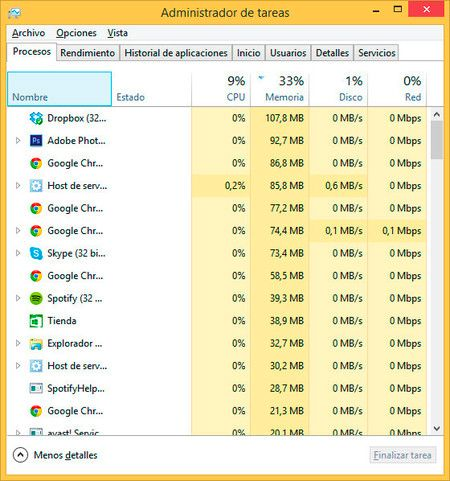
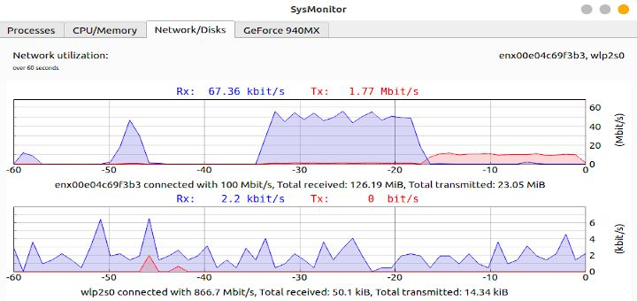
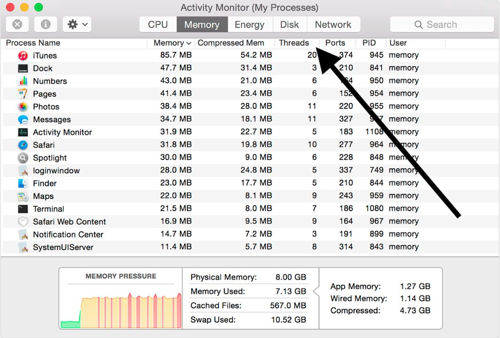

## $Leer$ $el$ $estado$ $del$ $sistema$ $(Administrador$ $de$ $tareas)$
## (hora, nº de procesos, etc.)

### Todo proceso en un sistema operativo presenta un estado que indica la situación de la ejecución en que se encuentra. El número de posibles estados varía de un sistema operativo a otro.

