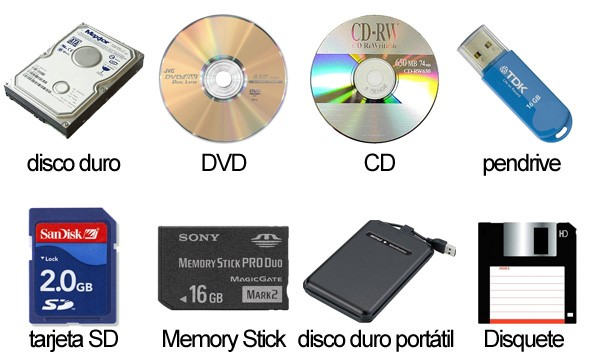
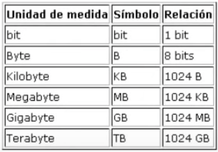

## $Unidades$ $de$ $almacenamiento$

## $Unidades$ $de$ $capacidad$

- La unidad mínima o básica es el **bit** y se representa por la letra b, simplemente es un 0 o 1, hay corriente o no hay corriente.
  
- El **Byte (B)** es la primera unidad de almacenamiento que tiene sentido, está compuesta por 8 bits, un Byte es aproximadamente un carácter.
  
- El **Kilobyte (KB)** equivale a 1024 Bytes.
  
- **Megabyte (MB)** 1024 KB.
  
- **Gigabyte (GB)** 1024 MB.
  
- **Terabyte (TB)** 1024 GB.

