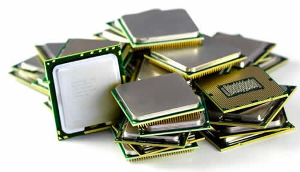
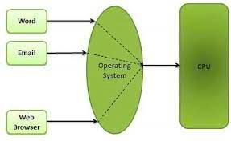

## **$Historia,$ $generaciones$ $y$ $evolución$**

Los sistemas operativos (SO) han evolucionado desde programas simples que gestionaban las primeras computadoras hasta sofisticadas plataformas multitarea y distribuidas.

## Primer Nivel (Siglo XX):

- No existían sistemas operativos como los conocemos hoy. Los programas se ejecutaban directamente en hardware mediante **tarjetas perforadas** y cables.
- Consistía en el uso de tarjetas perforadas que almacenaban información y eran decodificadas mediante un sistema binario.
- **FORTRAN** se introdujo por IBM con la facilidad de ser un lenguaje adaptado a estas tarjetas y ser más accesible y fácil de usar para los ingenieros y programadores que querían implementar fórmulas menos complejas (**For**mula **Tran**slating)

## Segundo Nivel (Siglo XX, 70's)

- La llegada de los **microprocesadores** sustituyó a los circuitos integrados, todos los componentes de un minúsculo chip hicieron posible el ordenador personal actual.
- Aparecen los procesos **online y offline**.
- **Buffering:** Aparece con la necesidad de gestionar datos mientras otros se procesaban en el Buffer (una unidad pequeña de memoria), evitando diferencias de velocidad.
- **Spooling** (Simultaneous Peripheral Operations On-Line): Aparece en la necesidad de hacer que los periféricos (dispositivos de E/S) no interfirieran en la productividad del CPU, esta técnica permitió almacenar los datos en cola mientras otros eran liberados.

## Tercer Nivel

- Aparece en los años 70 del siglo XX.
- El procesador ya tenía varios núcleos para poder dividir las tareas.
- Aparece la multiprogramación: ejecución de varios programas en un mismo procesador.

