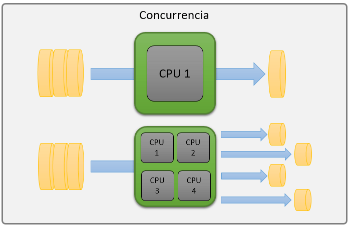
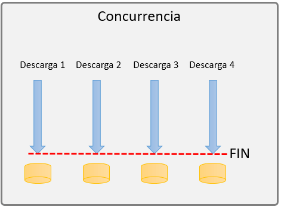

## $Concurrencia$

La concurrencia permite que un sistema gestione múltiples tareas de manera eficiente, haciendo que todas progresen al mismo tiempo al compartir el tiempo de procesamiento del sistema. Esto no significa que todas las tareas se ejecuten al mismo tiempo, sino que el sistema distribuye el tiempo de manera que varias tareas puedan avanzar sin tener que esperar una tras otra.

