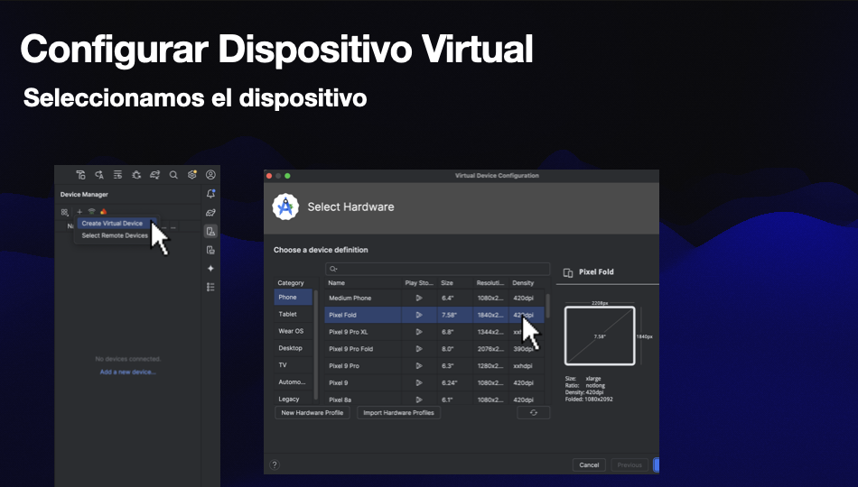
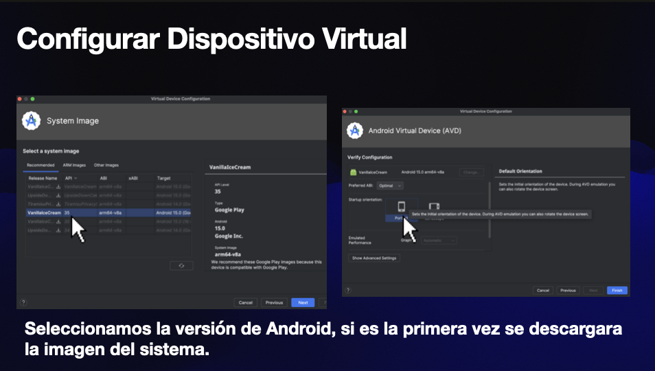
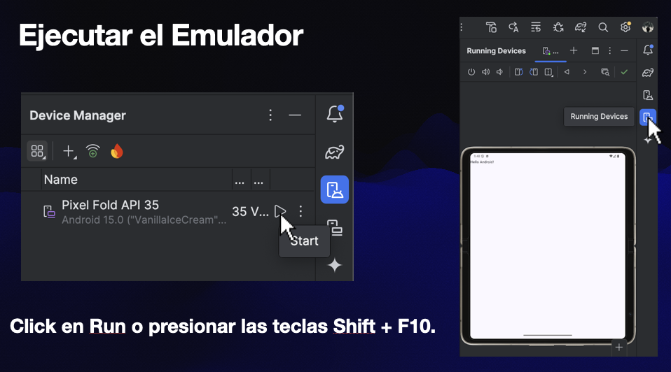

## $Sistemas$ $operativos$ $moviles$ 

Un sistema operativo es uno o varios programas que se usan para poder trabajar con los componentes de un equipo de computadora o dispositivo electrónico.

No solo existen sistemas operativos para computadoras, si no para dispositivos móviles, relojes, televisores, electrodomesticos, etc.

### Algunos sistemas operativos son:
- Google: Android
- Apple: iOS
- Huawei: HarmonyOS

### Descontinuados: 
  - LG: WebOS
  - Microsoft: Windows Phone

## Emulador de Android

Un emulador de Android es un software que permite ejecutar aplicaciones diseñadas para dispositivos Android en una computadora o en otros dispositivos que no sean Android. Esto es útil para desarrolladores, ya que les permite probar sus aplicaciones sin necesidad de tener un dispositivo físico Android, y también para usuarios que desean usar apps de Android en su PC o Mac.

