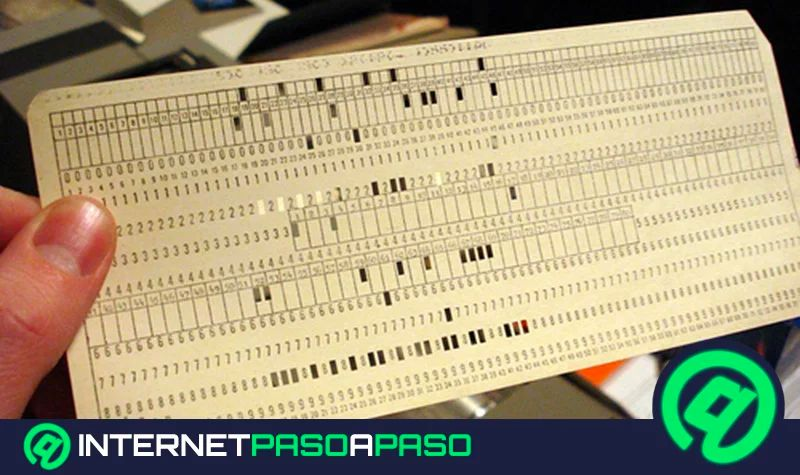
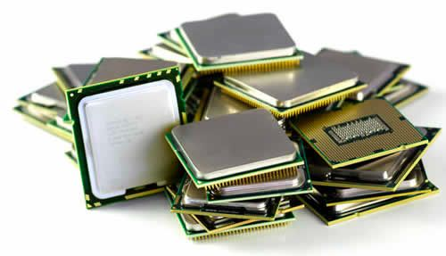

## **$Historia,$ $generaciones$ $y$ $evolución$**

Los sistemas operativos (SO) han evolucionado desde programas simples que gestionaban las primeras computadoras hasta sofisticadas plataformas multitarea y distribuidas.

## Primer Nivel (Siglo XX):

- No existían sistemas operativos como los conocemos hoy. Los programas se ejecutaban directamente en hardware mediante **tarjetas perforadas** y cables.
- Concistia en el uso de tarjetas perforadas que almacenaban informacion y eran decodificadas mediante un sistema binario
- **FORTRAN** se introdujo por IBM con la facilidad de ser un lenguaje adaptado a estas tarjetas y ser mas accesible y facil de usar para los ingenieros y programadores que querian implementar formulas menos complejas (**For**mula **Tran**slating)

## Segundo Nivel (Siglo XX, 70's)

- La llegada de los **microprocesadores** sustituyeron a los circuitos integrados, todos los componentes de un minusculo chip hicieron posible el ordenador personal actual.
- Aparecen los procesos **online y offline**
- **Buffering**: Aparece con la necesidad de gestionar datos mientras otros se procesaban en el Buffer (una unidad pequeña de memoria) evitando diferencias de velocidad.
- **Spooling** (Simultaneous Peripheral Operations On-Line): Aparece en la necesidad de hacer que los perifericos (dispositivos de E/S) no interfirieran en la productividad del CPU, esta tecnica permitio almacenar los datos en cola mientras otros eran liberados.

## Tercer Nivel