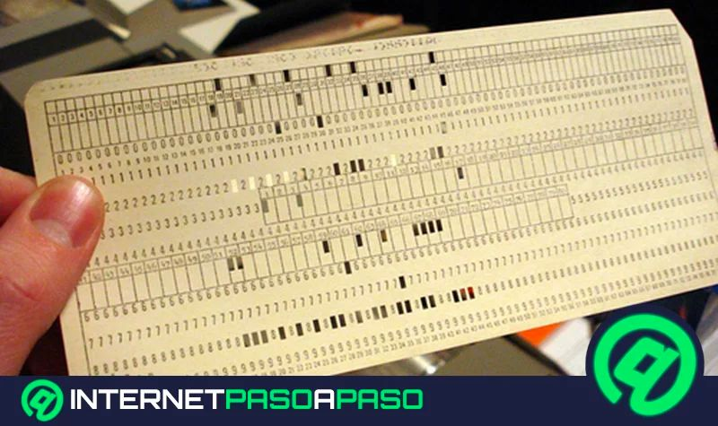

## **$Historia,$ $generaciones$ $y$ $evolución$**

Los sistemas operativos (SO) han evolucionado desde programas simples que gestionaban las primeras computadoras hasta sofisticadas plataformas multitarea y distribuidas.

## Primera Generación (1940-1950):

- No existían sistemas operativos como los conocemos hoy. Los programas se ejecutaban directamente en hardware mediante tarjetas perforadas y cables.
- Concistia en el uso de tarjetas perforadas que almacenaban informacion y eran decodificadas mediante un sistema binario
- FORTRAN se introdujo por IBM con la facilidad de ser un lenguaje adaptado a estas tarjetas y ser mas accesible y facil de usar para los ingenieros y programadores que querian implementar formulas menos complejas (**For**mula **Tran**slating)

